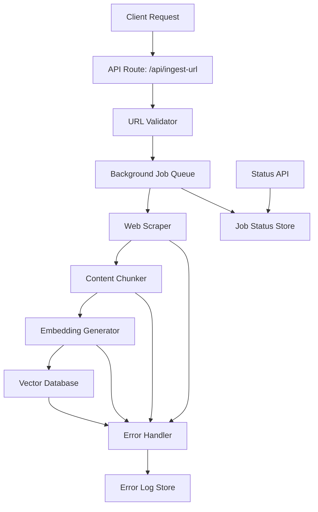

# Design Document: URL-Based Document Ingestion System

## Overview

The URL-based document ingestion system is designed as a scalable, asynchronous pipeline that transforms web-based API documentation into searchable vector embeddings. The system follows a multi-stage architecture: URL validation → Web scraping → Content chunking → Vector embedding → Database storage. It leverages Next.js API routes for the web interface, Playwright for robust web scraping, AWS Bedrock for embeddings, and PostgreSQL with pgvector for vector storage.

The design prioritizes reliability through comprehensive error handling, scalability through background job processing, and maintainability through clear separation of concerns. The system is built to handle various documentation formats and provides real-time feedback on ingestion progress.

## Architecture

### High-Level Architecture



### System Components

1. **API Layer**: Next.js API routes handling HTTP requests and responses
2. **Validation Layer**: URL validation and sanitization
3. **Job Queue**: Background processing system for long-running tasks
4. **Scraping Engine**: Playwright-based web scraping with JavaScript support
5. **Content Processing**: Text chunking and preprocessing pipeline
6. **Embedding Service**: AWS Bedrock integration for vector generation
7. **Storage Layer**: PostgreSQL with pgvector for vector and metadata storage
8. **Monitoring**: Status tracking and error reporting system

## Components and Interfaces

### 1. API Routes

#### `/api/ingest-url` (POST)
**Purpose**: Initiate document ingestion process
**Input**: 
```typescript
interface IngestRequest {
  url: string;
  options?: {
    maxDepth?: number;
    followLinks?: boolean;
    respectRobots?: boolean;
  };
}
```
**Output**:
```typescript
interface IngestResponse {
  jobId: string;
  status: 'queued' | 'processing' | 'completed' | 'failed';
  message: string;
}
```

#### `/api/ingest-status/[jobId]` (GET)
**Purpose**: Check ingestion job status
**Output**:
```typescript
interface StatusResponse {
  jobId: string;
  status: 'queued' | 'processing' | 'completed' | 'failed';
  progress: {
    pagesProcessed: number;
    chunksCreated: number;
    chunksEmbedded: number;
    errors: string[];
  };
  startedAt: string;
  completedAt?: string;
}
```

### 2. Core Services

#### URLValidator
```typescript
interface URLValidator {
  validate(url: string): Promise<ValidationResult>;
  sanitize(url: string): string;
  checkAccessibility(url: string): Promise<boolean>;
}

interface ValidationResult {
  isValid: boolean;
  errors: string[];
  sanitizedUrl?: string;
}
```

#### WebScraper
```typescript
interface WebScraper {
  scrape(url: string, options: ScrapingOptions): Promise<ScrapedContent>;
  extractText(html: string): Promise<string>;
  extractMetadata(html: string): Promise<PageMetadata>;
}

interface ScrapedContent {
  url: string;
  title: string;
  content: string;
  metadata: PageMetadata;
  links: string[];
}

interface ScrapingOptions {
  waitForSelector?: string;
  timeout?: number;
  userAgent?: string;
  respectRobots?: boolean;
}
```

#### ContentChunker
```typescript
interface ContentChunker {
  chunk(content: string, metadata: PageMetadata): Promise<DocumentChunk[]>;
  optimizeChunkSize(text: string, maxTokens: number): string[];
  preserveContext(chunks: string[], metadata: PageMetadata): DocumentChunk[];
}

interface DocumentChunk {
  id: string;
  content: string;
  metadata: ChunkMetadata;
  tokenCount: number;
}

interface ChunkMetadata {
  sourceUrl: string;
  title: string;
  section?: string;
  pageNumber?: number;
  chunkIndex: number;
}
```

#### EmbeddingService
```typescript
interface EmbeddingService {
  generateEmbeddings(chunks: DocumentChunk[]): Promise<EmbeddedChunk[]>;
  batchEmbed(texts: string[]): Promise<number[][]>;
  validateEmbedding(embedding: number[]): boolean;
}

interface EmbeddedChunk extends DocumentChunk {
  embedding: number[];
  embeddedAt: Date;
}
```

#### VectorStore
```typescript
interface VectorStore {
  store(chunks: EmbeddedChunk[]): Promise<StorageResult>;
  upsert(chunk: EmbeddedChunk): Promise<void>;
  search(query: number[], limit: number): Promise<SearchResult[]>;
  deleteBySource(sourceUrl: string): Promise<void>;
}

interface StorageResult {
  stored: number;
  updated: number;
  failed: number;
  errors: string[];
}
```

### 3. Background Job System

#### JobQueue
```typescript
interface JobQueue {
  enqueue(job: IngestionJob): Promise<string>;
  process(jobId: string): Promise<void>;
  getStatus(jobId: string): Promise<JobStatus>;
  updateProgress(jobId: string, progress: JobProgress): Promise<void>;
}

interface IngestionJob {
  id: string;
  url: string;
  options: IngestionOptions;
  status: JobStatus;
  createdAt: Date;
  startedAt?: Date;
  completedAt?: Date;
}
```

## Data Models

### Database Schema (Prisma)

```prisma
model DocumentChunk {
  id          String   @id @default(cuid())
  sourceUrl   String
  title       String
  content     String
  section     String?
  chunkIndex  Int
  tokenCount  Int
  embedding   Unsupported("vector(1536)")
  metadata    Json
  createdAt   DateTime @default(now())
  updatedAt   DateTime @updatedAt
  
  @@index([sourceUrl])
  @@index([embedding], type: Ivfflat)
  @@map("document_chunks")
}

model IngestionJob {
  id            String    @id @default(cuid())
  url           String
  status        JobStatus
  progress      Json
  options       Json
  errorMessage  String?
  createdAt     DateTime  @default(now())
  startedAt     DateTime?
  completedAt   DateTime?
  
  @@map("ingestion_jobs")
}

enum JobStatus {
  QUEUED
  PROCESSING
  COMPLETED
  FAILED
}
```

### Vector Index Configuration

```sql
-- Create vector extension
CREATE EXTENSION IF NOT EXISTS vector;

-- Create index for similarity search
CREATE INDEX ON document_chunks USING ivfflat (embedding vector_cosine_ops) WITH (lists = 100);

-- Create partial index for active chunks
CREATE INDEX ON document_chunks (source_url) WHERE created_at > NOW() - INTERVAL '30 days';
```

## Error Handling

### Error Categories and Responses

1. **Validation Errors**
   - Invalid URL format
   - Inaccessible URLs
   - Blocked by robots.txt

2. **Scraping Errors**
   - Network timeouts
   - JavaScript rendering failures
   - Content extraction failures

3. **Processing Errors**
   - Chunking failures
   - Token limit exceeded
   - Metadata extraction errors

4. **Embedding Errors**
   - AWS Bedrock API failures
   - Rate limit exceeded
   - Invalid embedding dimensions

5. **Storage Errors**
   - Database connection failures
   - Vector insertion errors
   - Transaction rollback scenarios

### Error Handling Strategy

```typescript
interface ErrorHandler {
  handleScrapingError(error: ScrapingError): Promise<ErrorResponse>;
  handleEmbeddingError(error: EmbeddingError): Promise<ErrorResponse>;
  handleStorageError(error: StorageError): Promise<ErrorResponse>;
  retryWithBackoff<T>(operation: () => Promise<T>, maxRetries: number): Promise<T>;
}

interface ErrorResponse {
  canRetry: boolean;
  retryAfter?: number;
  userMessage: string;
  logMessage: string;
  errorCode: string;
}
```

### Retry Logic

- **Network Operations**: Exponential backoff with jitter (1s, 2s, 4s)
- **AWS Bedrock**: Rate limit aware retry with 429 handling
- **Database Operations**: Connection pool retry with circuit breaker
- **Job Processing**: Dead letter queue for failed jobs after 3 attempts

## Testing Strategy

### Unit Testing

1. **URL Validation**
   - Valid/invalid URL formats
   - Accessibility checks
   - Sanitization logic

2. **Content Processing**
   - Chunking algorithms
   - Metadata extraction
   - Token counting accuracy

3. **Embedding Generation**
   - API integration
   - Batch processing
   - Error handling

4. **Database Operations**
   - Vector storage/retrieval
   - Metadata queries
   - Transaction handling

### Integration Testing

1. **End-to-End Pipeline**
   - Complete ingestion workflow
   - Error propagation
   - Status updates

2. **External Service Integration**
   - AWS Bedrock connectivity
   - PostgreSQL operations
   - Playwright browser automation

3. **Background Job Processing**
   - Queue management
   - Concurrent processing
   - Job status tracking

### Performance Testing

1. **Load Testing**
   - Concurrent ingestion requests
   - Large document processing
   - Database performance under load

2. **Scalability Testing**
   - Memory usage during processing
   - Vector search performance
   - Background job throughput

### Test Data and Mocking

```typescript
// Mock implementations for testing
interface TestMocks {
  mockWebScraper: WebScraper;
  mockEmbeddingService: EmbeddingService;
  mockVectorStore: VectorStore;
  testDocumentationSites: string[];
}

// Test utilities
interface TestUtils {
  createMockDocumentChunk(): DocumentChunk;
  generateTestEmbedding(): number[];
  setupTestDatabase(): Promise<void>;
  cleanupTestData(): Promise<void>;
}
```

### Testing Environment Setup

- **Test Database**: Isolated PostgreSQL instance with pgvector
- **Mock Services**: AWS Bedrock mocks for embedding generation
- **Browser Testing**: Headless Playwright for scraping tests
- **CI/CD Integration**: Automated testing on pull requests