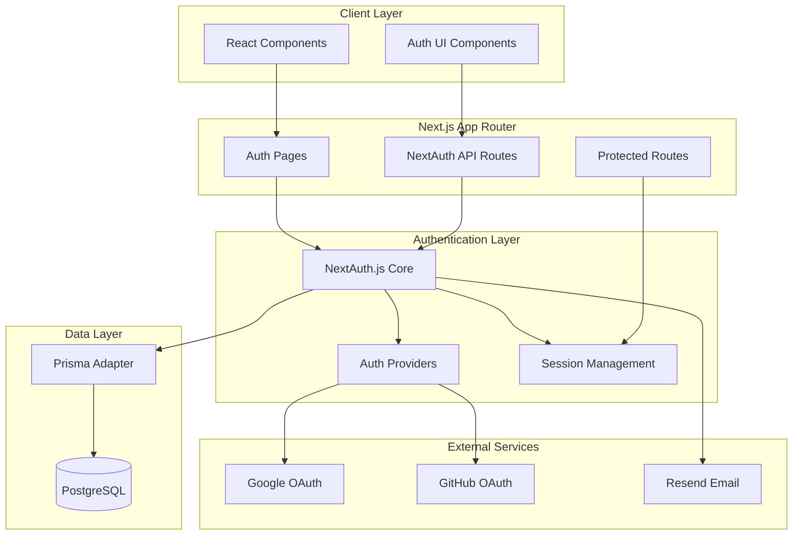
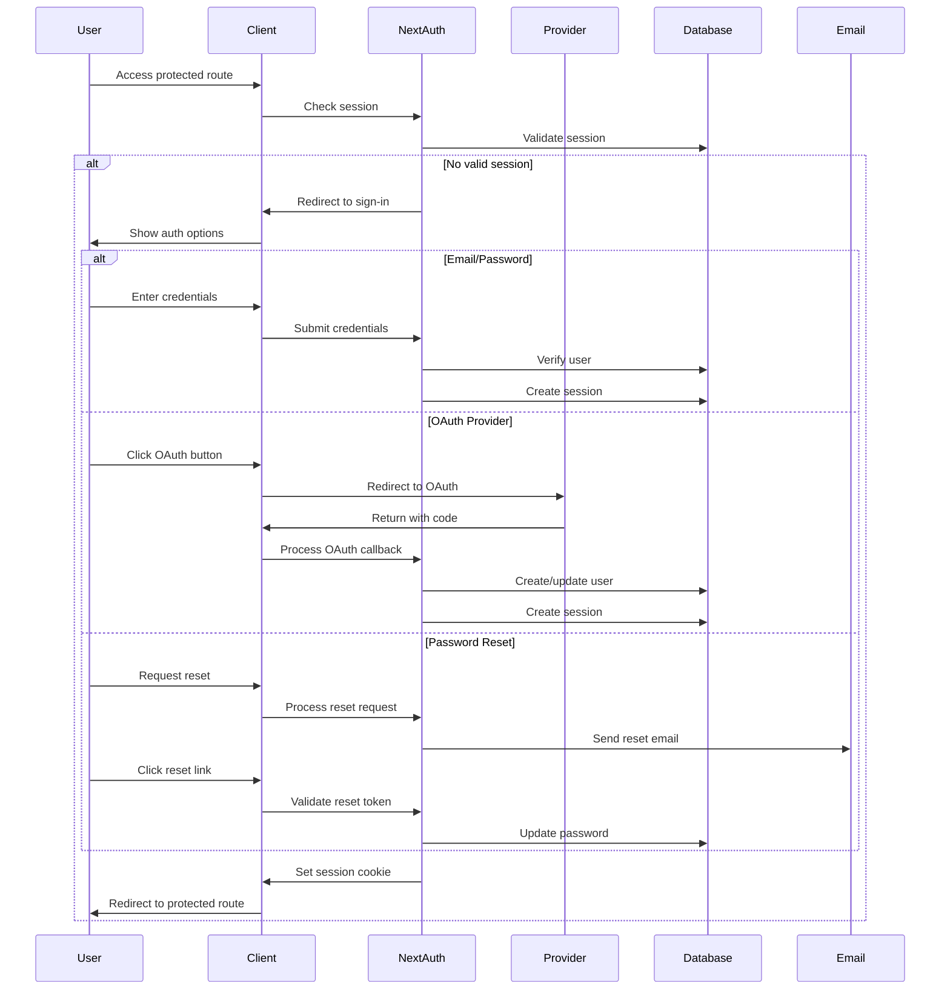
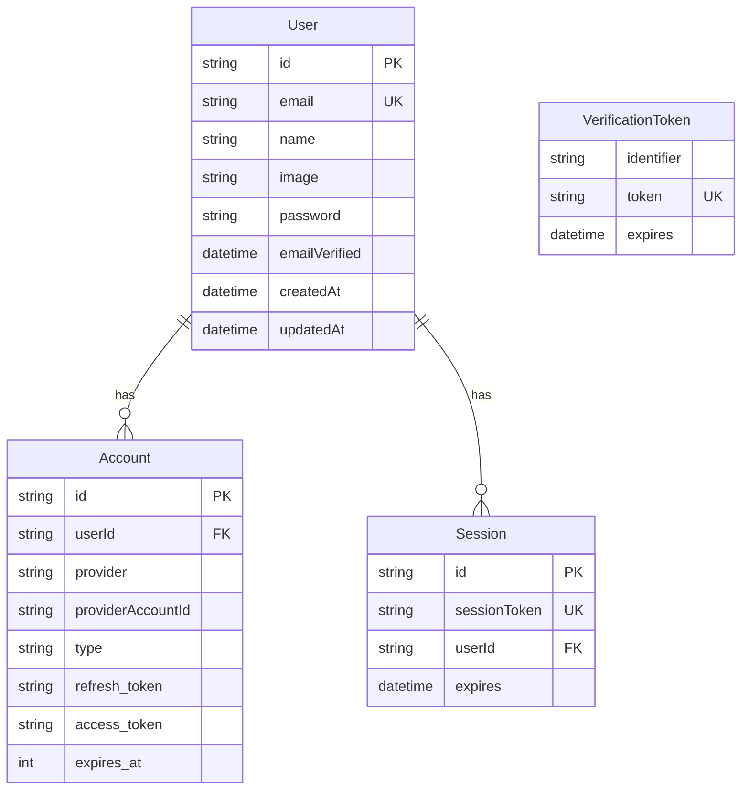

# User Authentication System Design

## Overview

The user authentication system will be built using NextAuth.js (Auth.js v5) as the core authentication framework, integrated with the existing PostgreSQL database via Prisma ORM. The system will support multiple authentication methods including email/password credentials and OAuth providers (Google, GitHub), with secure session management and password reset functionality using Resend for email delivery.

The design follows security best practices including proper session management, CSRF protection, secure password hashing, and rate limiting. The authentication system will be seamlessly integrated with the existing RAG chat application while maintaining the current architecture patterns.

## Architecture

### High-Level Architecture



### Authentication Flow



## Components and Interfaces

### Database Schema Extensions

The existing Prisma schema will be extended with NextAuth.js required tables:

```prisma
model Account {
  id                String  @id @default(cuid())
  userId            String  @map("user_id")
  type              String
  provider          String
  providerAccountId String  @map("provider_account_id")
  refresh_token     String? @db.Text
  access_token      String? @db.Text
  expires_at        Int?
  token_type        String?
  scope             String?
  id_token          String? @db.Text
  session_state     String?
  
  user User @relation(fields: [userId], references: [id], onDelete: Cascade)
  
  @@unique([provider, providerAccountId])
  @@map("accounts")
}

model Session {
  id           String   @id @default(cuid())
  sessionToken String   @unique @map("session_token")
  userId       String   @map("user_id")
  expires      DateTime
  
  user User @relation(fields: [userId], references: [id], onDelete: Cascade)
  
  @@map("sessions")
}

model User {
  id            String    @id @default(cuid())
  name          String?
  email         String    @unique
  emailVerified DateTime? @map("email_verified")
  image         String?
  password      String?   // For credential-based auth
  createdAt     DateTime  @default(now()) @map("created_at")
  updatedAt     DateTime  @updatedAt @map("updated_at")
  
  accounts Account[]
  sessions Session[]
  
  @@map("users")
}

model VerificationToken {
  identifier String
  token      String   @unique
  expires    DateTime
  
  @@unique([identifier, token])
  @@map("verification_tokens")
}
```

### NextAuth Configuration

**File: `src/lib/auth.ts`**

```typescript
import { NextAuthOptions } from "next-auth"
import { PrismaAdapter } from "@auth/prisma-adapter"
import GoogleProvider from "next-auth/providers/google"
import GitHubProvider from "next-auth/providers/github"
import CredentialsProvider from "next-auth/providers/credentials"
import { prisma } from "./db"
import { verifyPassword } from "./auth/password"
import { sendPasswordResetEmail } from "./auth/email"

export const authOptions: NextAuthOptions = {
  adapter: PrismaAdapter(prisma),
  providers: [
    CredentialsProvider({
      name: "credentials",
      credentials: {
        email: { label: "Email", type: "email" },
        password: { label: "Password", type: "password" }
      },
      async authorize(credentials) {
        // Implementation for credential verification
      }
    }),
    GoogleProvider({
      clientId: process.env.GOOGLE_CLIENT_ID!,
      clientSecret: process.env.GOOGLE_CLIENT_SECRET!,
    }),
    GitHubProvider({
      clientId: process.env.GITHUB_CLIENT_ID!,
      clientSecret: process.env.GITHUB_CLIENT_SECRET!,
    })
  ],
  session: {
    strategy: "jwt",
    maxAge: 30 * 24 * 60 * 60, // 30 days
  },
  callbacks: {
    // Custom callbacks for session and JWT handling
  },
  pages: {
    signIn: '/auth/signin',
    signUp: '/auth/signup',
    error: '/auth/error',
  }
}
```

### Authentication Components

**Core Components Structure:**
- `src/components/auth/SignInForm.tsx` - Email/password sign-in form
- `src/components/auth/SignUpForm.tsx` - Email/password registration form
- `src/components/auth/SocialAuthButtons.tsx` - Google/GitHub OAuth buttons
- `src/components/auth/PasswordResetForm.tsx` - Password reset request form
- `src/components/auth/NewPasswordForm.tsx` - New password setting form
- `src/components/auth/AuthLayout.tsx` - Common layout for auth pages

### API Routes

**Authentication API Routes:**
- `src/app/api/auth/[...nextauth]/route.ts` - NextAuth.js API handler
- `src/app/api/auth/signup/route.ts` - Custom signup endpoint
- `src/app/api/auth/reset-password/route.ts` - Password reset endpoint
- `src/app/api/auth/verify-email/route.ts` - Email verification endpoint

### Page Components

**Authentication Pages:**
- `src/app/auth/signin/page.tsx` - Sign-in page
- `src/app/auth/signup/page.tsx` - Sign-up page
- `src/app/auth/reset-password/page.tsx` - Password reset page
- `src/app/auth/new-password/page.tsx` - New password page
- `src/app/auth/error/page.tsx` - Authentication error page

## Data Models

### User Authentication Data Flow



### Password Security

- **Hashing Algorithm:** bcrypt with salt rounds of 12
- **Password Requirements:** Minimum 8 characters, validated on client and server
- **Reset Tokens:** Cryptographically secure, time-limited (1 hour expiration)
- **Rate Limiting:** Maximum 5 failed attempts per IP per 15 minutes

## Error Handling

### Authentication Error Types

```typescript
enum AuthErrorType {
  INVALID_CREDENTIALS = 'invalid_credentials',
  USER_NOT_FOUND = 'user_not_found',
  EMAIL_ALREADY_EXISTS = 'email_already_exists',
  INVALID_TOKEN = 'invalid_token',
  TOKEN_EXPIRED = 'token_expired',
  RATE_LIMITED = 'rate_limited',
  OAUTH_ERROR = 'oauth_error',
  EMAIL_SEND_FAILED = 'email_send_failed'
}
```

### Error Handling Strategy

1. **Client-Side Validation:** Real-time form validation with user-friendly messages
2. **Server-Side Validation:** Comprehensive validation with detailed error logging
3. **Security-First Messaging:** Generic error messages for security-sensitive operations
4. **Retry Mechanisms:** Automatic retry for transient failures (email sending)
5. **Fallback Options:** Alternative authentication methods when primary fails

### Logging and Monitoring

- **Authentication Events:** All sign-in/sign-up attempts with timestamps and methods
- **Security Events:** Failed login attempts, suspicious activity patterns
- **Performance Metrics:** Authentication response times, success rates
- **Error Tracking:** Detailed error logs with context for debugging

## Testing Strategy

### Unit Testing

**Authentication Logic Tests:**
- Password hashing and verification
- Token generation and validation
- Email template rendering
- Form validation logic

**Database Integration Tests:**
- User creation and retrieval
- Session management
- Account linking/unlinking
- Data consistency checks

### Integration Testing

**Authentication Flow Tests:**
- Complete sign-up flow (email/password)
- Complete sign-in flow (all providers)
- Password reset flow end-to-end
- OAuth provider integration
- Session management across requests

**Security Testing:**
- Rate limiting effectiveness
- CSRF protection validation
- Session hijacking prevention
- SQL injection prevention
- XSS protection validation

### End-to-End Testing

**User Journey Tests:**
- New user registration and first login
- Existing user authentication
- Password reset and recovery
- Account linking scenarios
- Multi-device session management

**Browser Compatibility:**
- Cross-browser authentication flows
- Mobile responsiveness
- Accessibility compliance
- Performance under load

### Test Environment Setup

```typescript
// Test utilities for authentication testing
export const createTestUser = async (overrides = {}) => {
  // Create test user with default or custom properties
}

export const mockOAuthProvider = (provider: 'google' | 'github') => {
  // Mock OAuth provider responses for testing
}

export const createAuthenticatedSession = async (userId: string) => {
  // Create authenticated session for testing protected routes
}
```

## Security Considerations

### Session Security
- **Secure Cookies:** HttpOnly, Secure, SameSite attributes
- **Session Rotation:** New session ID on privilege escalation
- **Concurrent Sessions:** Configurable limit per user
- **Session Invalidation:** Immediate invalidation on logout

### OAuth Security
- **State Parameter:** CSRF protection for OAuth flows
- **PKCE:** Proof Key for Code Exchange for enhanced security
- **Scope Limitation:** Minimal required permissions
- **Token Storage:** Secure storage of refresh/access tokens

### Password Security
- **Strength Requirements:** Configurable complexity rules
- **Breach Detection:** Integration with HaveIBeenPwned API
- **Reset Security:** Time-limited, single-use reset tokens
- **History Prevention:** Prevent reuse of recent passwords

### Rate Limiting
- **Login Attempts:** Progressive delays for failed attempts
- **Registration:** Limit account creation per IP
- **Password Reset:** Limit reset requests per email
- **API Endpoints:** General rate limiting for auth endpoints